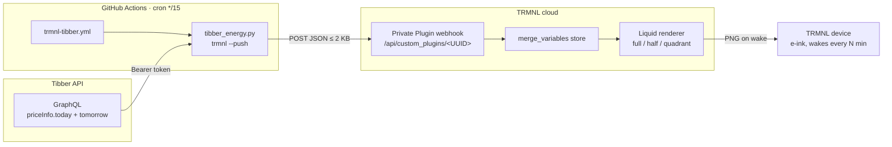
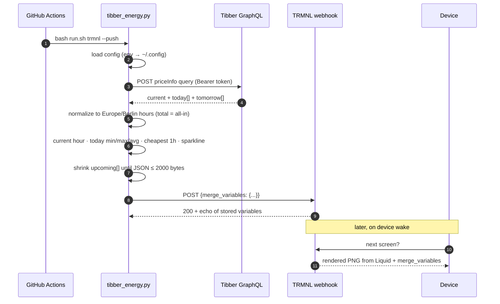
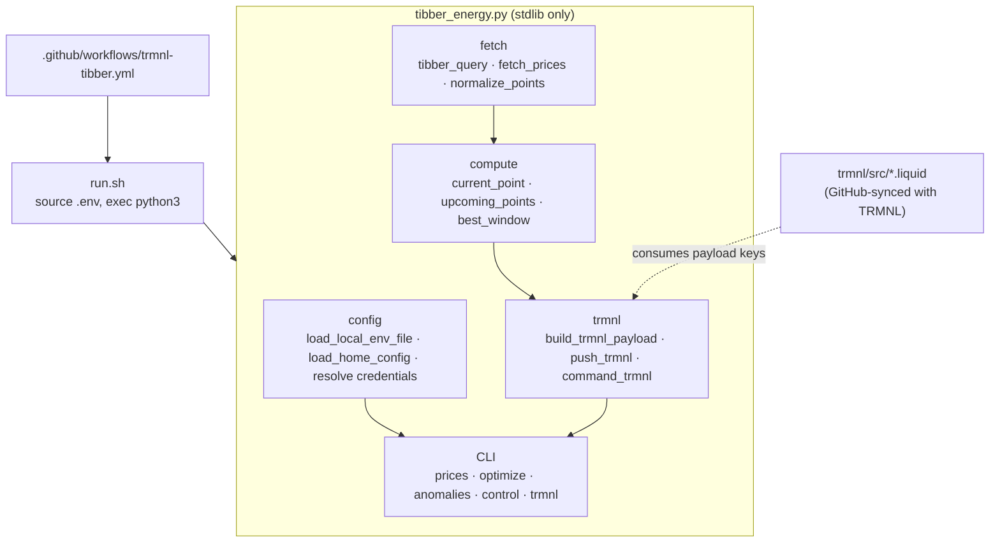
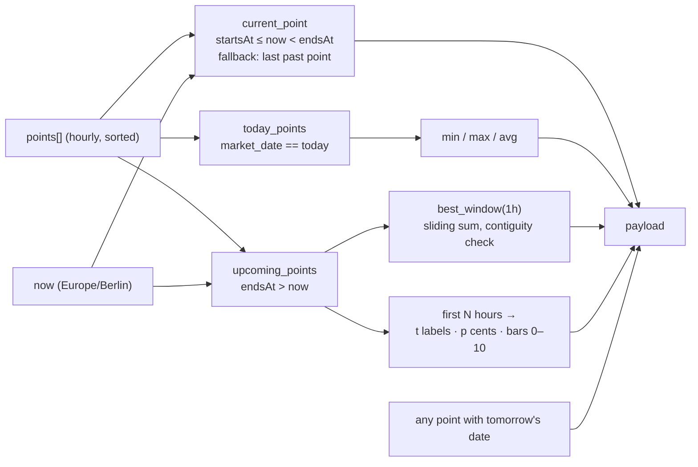
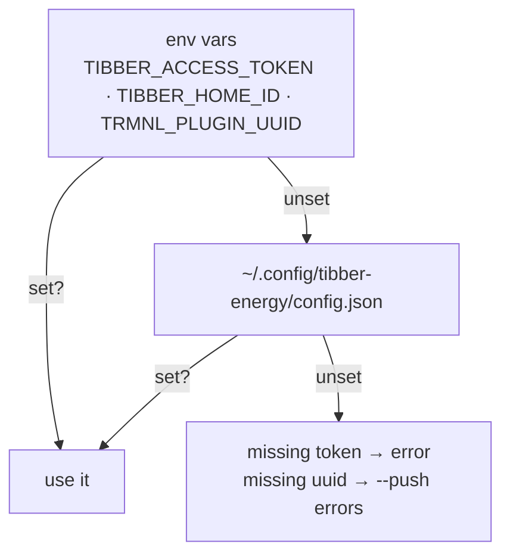

# trmnl-tibber

[Tibber](https://tibber.com) retail electricity prices (hourly, all-in per kWh) on a [TRMNL](https://trmnl.com) e-ink display.

A GitHub Actions cron runs a single stdlib-only Python script every 15 minutes. The script authenticates to the Tibber GraphQL API, reads today’s and tomorrow’s hourly `priceInfo` points (`total` = energy + tax), computes the current hour, today’s min/avg/max, the cheapest upcoming window and a sparkline, and POSTs a compact JSON payload to a TRMNL Private Plugin webhook. TRMNL renders it with the Liquid markup in this repo and the device pulls the image on its next wake.

You need a Tibber personal access token. The TRMNL plugin UUID is the only other secret.

Modeled on [trmnl-omie](https://github.com/pmagnomuller/trmnl-omie); reuses auth + fetch patterns from [tibber-energy](https://github.com/pmagnomuller/tibber-energy).

---

## Table of contents

- [How it works](#how-it-works)
  - [System overview](#system-overview)
  - [Data flow, one push](#data-flow-one-push)
  - [Where the time goes](#where-the-time-goes)
- [Architecture](#architecture)
  - [Components](#components)
  - [Data source: Tibber GraphQL](#data-source-tibber-graphql)
  - [Payload](#payload)
  - [Rendering](#rendering)
  - [Configuration precedence](#configuration-precedence)
- [Setup](#setup)
- [Local use](#local-use)
- [Repo layout](#repo-layout)
- [Design decisions](#design-decisions)
- [Related](#related)

---

## How it works

### System overview



Two independent loops, decoupled by TRMNL’s `merge_variables` store:

| Loop | Driver | Cadence | What it does |
|---|---|---|---|
| **Push** | GitHub Actions cron | every 15 min | fetch Tibber → compute → POST payload |
| **Pull** | TRMNL device firmware | playlist refresh (15–30 min) | fetch rendered image, sleep |

The device never talks to this repo or to Tibber. TRMNL always has the last successful payload, so a failed push just means a stale hour label, not a blank screen.

### Data flow, one push



### Where the time goes

```mermaid
gantt
    title Timing on a typical day (Europe/Berlin)
    dateFormat HH:mm
    axisFormat %H:%M
    section Tibber
    Today's hourly prices available                  :done, 00:00, 24h
    Tomorrow's prices published (afternoon)          :milestone, 13:00, 0m
    section Push loop
    Cron every 15 min                                :active, 00:00, 24h
    section Payload
    tomorrow_ready = false                           :00:00, 13h
    tomorrow_ready = true                            :13:00, 11h
```



Day-ahead retail prices only change when Tibber publishes the next day’s hours (typically afternoon). The 15-minute cron exists to move the “Now” hour label, recompute the cheapest-next window from the current time, and flip `tomorrow_ready` once tomorrow’s array is non-empty.

---

## Architecture

### Components



- **`run.sh`** loads a local `.env` if present, then `exec`s the script. Keeps secrets out of shell history and out of the workflow file.
- **`tibber_energy.py`** is one file on purpose: copy it anywhere with Python 3.9+ and it runs. Dependencies are `urllib`, `json`, `zoneinfo`, `argparse`.
- **Liquid templates** are the only TRMNL-side code. They read payload keys, nothing else. The plugin can be connected to this repo via TRMNL’s GitHub sync, so edits in `trmnl/src/` on `main` land in the plugin.
- **Workflow** is short: checkout, setup-python, run with secrets injected as env vars.

### Data source: Tibber GraphQL

Endpoint: `https://api.tibber.com/v1-beta/gql`

Query path used:

```
viewer.homes[].currentSubscription.priceInfo {
  current { total energy tax startsAt currency level }
  today   { ... }
  tomorrow { ... }
}
```

- **`total`** is the all-in retail price the customer pays (energy + tax / fees as Tibber reports them), in the home’s currency per kWh.
- **Resolution is hourly.** Each point gets an `endsAt = startsAt + 1h` in `Europe/Berlin` for slot labels and “current hour” matching.
- If the account has multiple homes, set `TIBBER_HOME_ID`; otherwise the first home is used.
- Currency comes from the API (`EUR` for German homes, `SEK` for Swedish, etc.) and is passed through to Liquid.

### Payload

`build_trmnl_payload` produces this shape (trimmed):

```json
{
  "area": "DE",
  "area_label": "Home nickname or city",
  "currency": "EUR",
  "updated_at": "2026-09-23T10:30:00+02:00",
  "updated_label": "10:30",
  "current": {
    "price_eur_kwh": 0.2841,
    "price_cents_kwh": 28,
    "price_label": "0.2841",
    "starts_at": "2026-09-23T10:00:00+02:00",
    "ends_at":   "2026-09-23T11:00:00+02:00",
    "slot_label": "10:00–11:00",
    "level": "NORMAL",
    "currency": "EUR"
  },
  "today": { "min": 0.19, "max": 0.35, "avg": 0.26 },
  "today_min_label": "0.1900",
  "today_max_label": "0.3500",
  "today_avg_label": "0.2600",
  "cheapest_next": {
    "starts_at": "...", "ends_at": "...",
    "label": "13:00–14:00",
    "avg_eur_kwh": 0.2012, "avg_cents_kwh": 20, "hours": 1
  },
  "upcoming": {
    "t":     ["10:00", "11:00", "..."],
    "p":     [28, 25, "..."],
    "bars":  [7, 5, "..."],
    "count": 24
  },
  "tomorrow_ready": true
}
```

How each block is computed:



- **`best_window`** is a sliding window over `upcoming`, rejecting any chunk whose consecutive timestamps aren’t exactly 1 hour apart (guards DST gaps and missing rows). Cheapest = lowest sum of all-in price.
- **`bars`** are min-max normalised to integers 0–10 so Liquid can do `height: {{ h | times: 10 }}%` without floats.
- **Size guard**: TRMNL’s webhook guidance is ~2 KB. If the compact JSON exceeds 2000 bytes, `upcoming_count` is retried at 20, 16, 12, 8. A typical payload is well under 1 KB.
- Field names keep the `price_eur_kwh` / `avg_eur_kwh` keys from `trmnl-omie` for template compatibility; values are still the home’s currency (see `currency`).

### Rendering

TRMNL stores the POSTed `merge_variables` and re-renders on each device fetch. The templates only use these keys:

| Template | Uses |
|---|---|
| `full.liquid` | `current.*`, `cheapest_next.*`, `today_*_label`, `upcoming.bars`, `upcoming.t`, `upcoming.count`, `area_label`, `currency`, `updated_label` |
| `half_vertical.liquid` | subset: current, cheapest next, today stats |
| `quadrant.liquid` | current price + slot, cheapest next label |

Title bars say **Tibber**. The sparkline is a CSS-only bar chart: a `grid--cols-{{ upcoming.count }}` with one `div` per bar whose height is `bars[i] × 10 %`.

### Configuration precedence



`run.sh` sources `./.env` into the environment before Python starts. In GitHub Actions the workflow sets secrets directly.

---

## Setup

1. **TRMNL → Plugins → Private Plugin → Add.** Strategy **Webhook**. Name it **Tibber**, save. Copy the UUID from the webhook URL `https://trmnl.com/api/custom_plugins/<UUID>`.
2. **Markup.** Either connect the plugin to this repo (plugin → *Connect to GitHub*, folder `trmnl`) so `trmnl/src/*.liquid` and `settings.yml` sync both ways, or paste each file from [`trmnl/src/`](trmnl/src/) into its layout tab manually.
3. **Tibber token.** Create a personal access token at [developer.tibber.com](https://developer.tibber.com). If you have more than one home, note the home id.
4. **Test from your machine** before touching CI:
   ```bash
   cp .env.example .env
   # edit: TIBBER_ACCESS_TOKEN, optional TIBBER_HOME_ID, TRMNL_PLUGIN_UUID
   bash run.sh trmnl              # dry-run JSON to stdout
   bash run.sh trmnl --push       # → Pushed to TRMNL (200): {...}
   ```
5. **Enable the cron:**
   ```bash
   gh secret set TIBBER_ACCESS_TOKEN -R <you>/trmnl-tibber
   # optional:
   # gh secret set TIBBER_HOME_ID -R <you>/trmnl-tibber
   gh secret set TRMNL_PLUGIN_UUID -R <you>/trmnl-tibber
   gh workflow run trmnl-tibber.yml -R <you>/trmnl-tibber
   gh run watch -R <you>/trmnl-tibber
   ```
6. **Playlist.** Add the plugin to your device playlist. 15–30 min refresh is enough.

Field-by-field payload reference and troubleshooting: [`trmnl/SETUP.md`](trmnl/SETUP.md).

---

## Local use

The same script is a general Tibber CLI / agent skill.

```bash
bash run.sh trmnl                       # print payload, no push
bash run.sh trmnl --push                # push once

bash run.sh prices --hours 36           # next N hours, all-in
bash run.sh optimize --duration-hours 2 # cheapest contiguous block from now
bash run.sh optimize --kwh 28 --power-kw 11

bash run.sh anomalies --lookback-hours 168 --sigma 2.5

# dry-run: prints which command would fire
bash run.sh control --price-below 0.20 \
  --on-command "echo on" --off-command "echo off"
# add --execute to actually run them
```

Thresholds for `optimize` / `control` use the home’s all-in price unit (same as Tibber `total`). Display timestamps are `Europe/Berlin`.

---

## Repo layout

```
.
├── tibber_energy.py              # everything: fetch, compute, CLI, TRMNL push
├── run.sh                        # source .env, exec python3
├── requirements.txt              # empty on purpose (stdlib only)
├── .env.example                  # TIBBER_* + TRMNL_PLUGIN_UUID
├── config.json.example           # same keys, for ~/.config/tibber-energy/
├── SKILL.md                      # agent-skill metadata
├── trmnl/
│   ├── SETUP.md                  # TRMNL walkthrough + payload field table
│   ├── .trmnlp.yml               # trmnlp serve config
│   └── src/                      # synced both ways with the TRMNL plugin
│       ├── settings.yml
│       ├── full.liquid
│       ├── half_vertical.liquid
│       └── quadrant.liquid
└── .github/workflows/
    └── trmnl-tibber.yml          # */15 cron + workflow_dispatch
```

---

## Design decisions

- **Push, not poll.** TRMNL’s Polling strategy would need a public URL serving JSON. Webhook + GitHub Actions needs nothing hosted.
- **Stdlib only.** One file, no PyPI deps — survives skill runners and Actions runners alike.
- **Compute on the pusher, not in Liquid.** Liquid has no date math and clumsy floats. All labels, rounding and normalisation happen in Python; templates only place strings.
- **Idempotent pushes.** Every run rebuilds the full payload. No state, no diffing, safe to re-run.
- **Same payload shape as trmnl-omie.** Shared Liquid patterns; hourly instead of 15-min, retail `total` instead of wholesale marginal.
- **Fail loud in CI, fail soft on data.** Missing secrets exit 1. Empty tomorrow array is normal and sets `tomorrow_ready: false`.

---

## Safety

- Never commit `.env` or real tokens. Use `.env.example` and GitHub Actions secrets only.
- Keep `control --execute` off until thresholds are verified in dry-run.

## Related

- [tibber-energy](https://github.com/pmagnomuller/tibber-energy) — original skill this grew from
- [trmnl-omie](https://github.com/pmagnomuller/trmnl-omie) — sibling plugin for Iberian OMIE day-ahead (15-min)
- [ostrom-energy](https://github.com/pmagnomuller/ostrom-energy) — sibling skill for another German retail tariff
- Tibber docs: [developer.tibber.com](https://developer.tibber.com)
- TRMNL docs: [Private Plugins](https://help.trmnl.com/en/articles/9510536-private-plugins)
